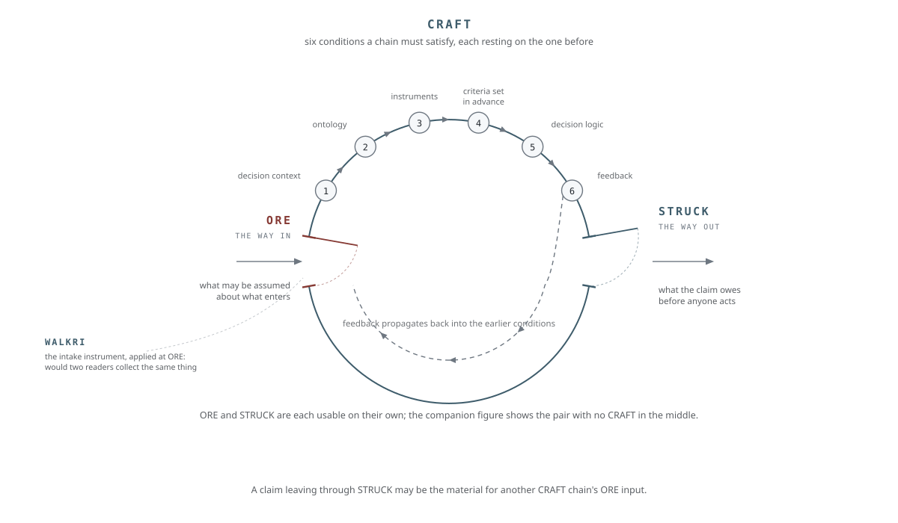

# CRAFT: Chains Reveal Attested Falsifiable Truth

CRAFT is an open meta-standard for evaluation chains. An evaluation chain is any system that takes in information from the world, processes it through a sequence of steps, and produces a claim that drives a decision about real people, organizations, funds, or risks. CRAFT states the conditions an evaluation chain must satisfy for the claim at the end of it to be reliable, and it states them without prescribing any particular technology or mechanism. CRAFT specifies what must be true; it does not specify how to build it.

## What it is for

Many failures of measurement and evaluation are not failures of execution. They are failures of specification: the system was never required to state what it measures, under what conditions its readings hold, and how an error would be caught. When the design is left implicit, there is no record of what the system is for, so it cannot be held accountable to a standard that was never written down. CRAFT closes that gap by requiring the design choices to be explicit before the system operates, so a claim can be audited before it is acted on rather than after it breaks.

## A meta-standard

CRAFT is a meta-standard, which means its purpose is to let others build domain standards correctly. A third party can use CRAFT's construction grammar to write a conformant evaluation standard for a specific field, through inside analysis of that field's own failure modes, without coordinating with the CRAFT maintainers. The six conditions and the construction grammar are domain-agnostic; the worked detail of any one domain belongs to that domain's own application.

## How it relates to the other open standards

CRAFT sits within a set of open, freely licensed standards, each building on the one beneath it. The Coordination Structural Integrity Suite specifies what must be structurally present for any evaluation or coordination structure to be sound, independent of domain. Frame Language is the shared vocabulary those standards use to distinguish structural grounding from aspiration. CRAFT builds on both to specify the conditions a domain-specific evaluation standard must meet. Each layer inherits from the one beneath it, and nothing in a higher layer is coherent without the layer below. All of them are free to use.

CROSS, the Common Reporting Outcome Standards Schema, is the first domain application built on CRAFT, the proof that the construction grammar produces a conformant standard and the example later applications follow; see the CROSS standard itself for its requirements.

[ORE](https://github.com/CrossWalkri/ORE), Origin, Reliability, Exposure, is CRAFT's input-stage companion specification, a different class of document from a domain application. The CRAFT specification names the input stage as one failure class among several and solves the general case of the chain; ORE elaborates that named case: what a chain is allowed to assume about the sources feeding it, graded as uncertainty rather than judged as quality. ORE is not a CRAFT domain application and carries no inheritance receipt; it is a companion. A chain builder addresses the input-stage failure class CRAFT names by adopting ORE or by meeting equivalent declared obligations; as of specification v0.4.4 this is a Section 6.1 compliance requirement, the ingestion boundary declaration. A condition-by-condition map of where ORE attaches to each of the six conditions is published in the ORE repository as `ore-craft-condition-map`. Together with WALKRI at the field level and STRUCK at the claim level, the family covers the evidence path end to end:

The through line, stated once: every system that turns records into decisions has the same anatomy. Sources feed in material the system did not create, fields capture that material as data, and a chain of evaluation carries it to a claim someone acts on. Knowing begins honestly, or begins broken, in three places, and one standard stands at each: [ORE](https://github.com/CrossWalkri/ORE) at the source boundary, [WALKRI](https://github.com/CrossWalkri/WALKRI) at the field, CRAFT over the whole path. One commitment runs through all three: no silent trust anywhere, and the worth-judgment left visible in the hands, human or automated, that make it. Each is independently adoptable; the through line is what they hold together.

How CRAFT relates to the other open standards in the suite, and how they compose, is documented in the framework overview rather than here, so that the cross-standard relationships are maintained in one place.

## Documents in this repository

- `craft-specification-0_4_4.md`: the meta-standard itself. Six conditions for a reliable evaluation chain, plus the construction grammar and inheritance requirements for building a conformant domain application.
- `craft-condition-composition-principles-0_1_0.md`: how the six conditions compose at the boundary between CRAFT and a domain application.

## Self-application disclosure

CRAFT's Section 7.2 states an invariant: the basis on which a chain's output can be overturned must not be controlled by the party whose claim is being evaluated. Applied to this specification itself, that invariant does not currently hold, and this disclosure states so rather than leaving it silent. The specification is self-attested: no independent party has yet attested, on the record, that its conditions are falsifiable in substance rather than only in form. It has no external challenge history, and its first domain application (CROSS) was built in-house, so in-house use cannot serve as independent confirmation. In ORE's terms, CRAFT is presently a well-formed source whose confirmation architecture is single-party and trust-based, with no track record and an interested grader; that is a statement of uncertainty carried openly, not a verdict.

Three repairs are in motion, in order of weight: an independent attestation is being sought from a qualified party with no stake in this work; challenges to any condition are open to anyone through this repository's issue tracker and will be resolved on the record; and track record accrues only as the specification operates in hands other than its author's and survives challenges its author did not design. This section will be revised as each lands, and its revision history is part of the record.

## License

The specification documents in this repository are licensed under the Creative Commons Attribution 4.0 International License; see `LICENSE-SPEC`. Any code or software artifacts are licensed under the Apache License 2.0; see `LICENSE`. This matches the licensing of the Coordination Structural Integrity Suite.
