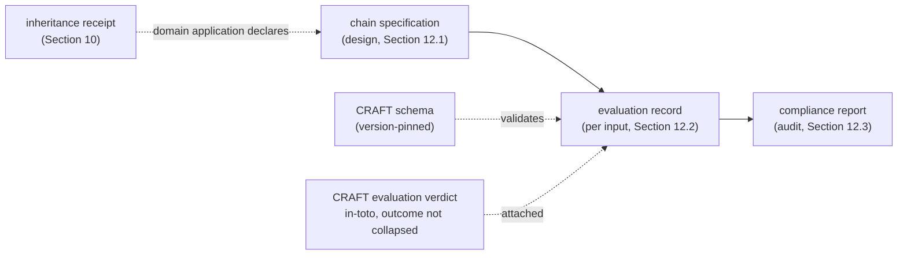

# CRAFT as a machine-readable contract

A short read for engineers deciding whether this is the shape they want for an evaluation chain and its records.

## The problem this addresses

Every system that turns inputs into a claim that drives a decision is an evaluation chain: a grants review, a risk score, an oracle, a moderation pipeline. When the claim later turns out wrong, the failure is usually not in one number but in the chain's design: the decision it was built for was never stated, the criteria were set after the data arrived, a rejection carried no signal back to the stage that caused it. These are legibility failures, and they are invisible until something breaks because nothing in the output recorded them. CRAFT makes the design of a chain, and the record of each thing the chain does, into checkable artifacts, so a reader can tell whether the chain is one whose claims can be relied on. This directory is that discipline expressed as machine-readable contracts.

## What CRAFT is, in one line

CRAFT is the meta-standard for evaluation chains: the six conditions a chain must satisfy, the construction grammar a domain application adds, and the three machine-readable outputs a conformant system produces (a specification, an evaluation record per instance, and an audit-time compliance report).

## The outcome is a class, not a score

CRAFT's runtime record carries an outcome of accepted, rejected, or indeterminate, derived from the reading against the pre-specified threshold while carrying the instrument's uncertainty. Indeterminate is its own class: the reading plus-or-minus its uncertainty straddles the threshold, so the instrument could not resolve the outcome, and that non-resolution is information the feedback loop must carry rather than round away. The schema keeps it a distinct value and never a collapsed number, and the closed top level forbids a smuggled aggregate that would flatten the layered outcome back into one score.

## Layer attribution, so a rejection is traceable

Every condition finding declares which layer produced it: the CRAFT base, the domain application, or a per-axis quality instrument. A rejection with no layer attribution cannot be used for root cause analysis, because the prior stage the signal must propagate to depends on where the failure originated. The schema requires the layer on every finding, so the architectural hierarchy is preserved rather than flattened, which is exactly what Section 12 demands.

## One source, every format

The prose standard and the machine-readable schema come from one source, neither a byproduct of the other (the FHIR pattern). One LinkML model generates the JSON Schema, the Zod, the JSON-LD context, SHACL, OWL, and GraphQL, plus an evaluation verdict and a SARIF findings run. Edit the standard, regenerate, and every format moves together. Nothing is hand-maintained, so no format can silently fall behind the standard.

## How it fits a chain

CRAFT is the contract for the design of a chain, for each record the running chain emits, and for the audit that checks the design.

The Zod (`dist/craft.zod.ts`) is the runtime source of truth for a TypeScript chain; the JSON Schema is the language-neutral contract; the JSON-LD and SHACL are for the graph side. The evaluation record is the tree root; the inheritance receipt and compliance report are companion classes a domain application and an auditor validate against.

## What the schema does and does not decide

CRAFT's obligations split, and for a meta-standard most fall on the judgment side. Some are **shape**: a schema can enforce that an evaluation record carries its required fields, that the outcome is one of the three classes, that every finding declares its layer, that a non-accept outcome carries propagation targets, and that an inheritance's background-satisfied claim carries a validation date. Most are **judgment**: whether the six conditions are actually satisfied, whether each condition is structurally operative rather than compliance-scheduled, whether the specification was examined from at least two directional origins, whether the construct-to-estimand adequacy claim meets the independent-observer test. The register (`src/craft-register.yaml`) marks each obligation as shape, judgment, or mixed. The schema enforces the shape; the judgment obligations are the attesting party's, and this directory is honest about that line rather than pretending a schema settles CRAFT conformance.

## Where this fits the family

CRAFT is the chain-legibility standard between two doors that share this one-source-generate approach: ORE at the input boundary (what a chain may assume about its sources), STRUCK at the exit boundary (what an evidence-grade output carries on its face), and WALKRI, CRAFT's sister at the field level, for the quality of the instruments a domain collects through. CRAFT validates that WALKRI's own specification is itself a legitimate evaluation chain, and WALKRI validates that a CRAFT decomposition produced well-formed instruments; neither is exempt from the other. Proving the pipeline on STRUCK, ORE, WALKRI, and now CRAFT means the shape and the tooling are settled.
