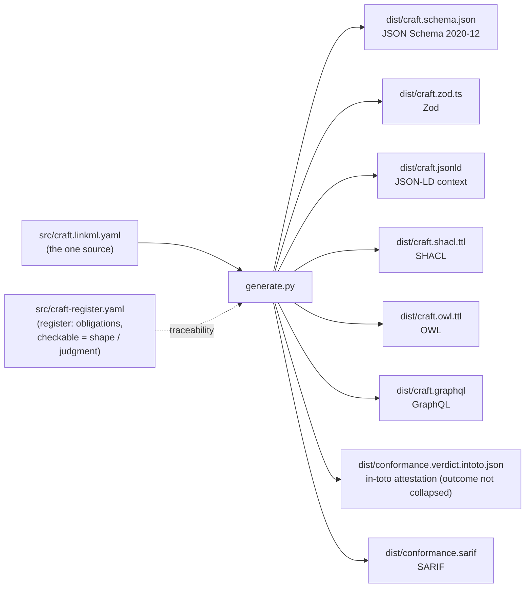

# CRAFT, machine-readable

Machine-readable artifacts for the CRAFT meta-standard (`craft-specification`, internal v0.4.6, CC0), the standard for the legibility of an evaluation chain: the conditions a chain must satisfy for the claim at the end of it to be relied on. Every artifact here is **generated from one source**, never hand-edited, so the schema an agent validates against cannot drift from the standard.

If you only want the file to validate against, it is [`dist/craft.schema.json`](dist/craft.schema.json) (JSON Schema 2020-12) or [`dist/craft.zod.ts`](dist/craft.zod.ts) (Zod). For why this exists and how it fits a chain, see [EXPLAINER.md](EXPLAINER.md).

CRAFT specifies what must be true of an evaluation chain, not how to build it.

## The pipeline



One LinkML model generates the schema and semantic tier; thin adapters in `generate.py` carry what LinkML does not (pin the JSON Schema draft and the `$id`, close the top-level schema so no flattening field slips past; emit Zod from the dereferenced schema; project the evaluation verdict to in-toto and SARIF). The register (`src/craft-register.yaml`) marks each of CRAFT's obligations as **shape** (a schema can enforce it), **judgment** (a reader must assess it), or **mixed**. Because CRAFT is a meta-standard, most of its obligations (whether the six conditions are satisfied, whether a condition is structurally operative rather than compliance-scheduled, whether the specification was examined from two directional origins) are audit-time judgments; the shape rows are the Section 12 output-schema constraints.

## The objects

CRAFT specifies three structurally distinct outputs at three times (Section 12). The tree-root object is the **evaluation record** (Section 12.2): what a chain did with one input at one time, carrying an outcome of accepted, rejected, or indeterminate that is not collapsible, per-condition findings that each carry a layer attribution (`craft_base`, `domain_application`, or `per_axis_quality`) so a rejection is traceable to the layer that produced it, and propagation targets on every non-accept outcome so the feedback loop carries what it must. The companion classes are the **inheritance receipt** (Section 10), the declaration a CRAFT-conformant domain application produces (the chain-level receipt, the Precision Toolkit scope of CSIS standards and Frame Language, and a five-element activity profile per inheritance whose background state is dated), and the **compliance report** (Section 12.3), the audit-time verdict on whether a specification meets CRAFT, each finding carrying its layer.

## What each artifact is, and who consumes it

| Artifact | Format | Consumer |
|---|---|---|
| `dist/craft.schema.json` | JSON Schema 2020-12 | any validator; the canonical contract for the evaluation record, with the inheritance receipt and compliance report as companion classes in `$defs` |
| `dist/craft.zod.ts` | Zod / TypeScript | runtime validation in a TS pipeline; a source of truth for agents |
| `dist/craft.jsonld` | JSON-LD context | linked-data / graph ingestion |
| `dist/craft.shacl.ttl` | SHACL shapes | validating CRAFT data expressed as RDF |
| `dist/craft.owl.ttl` | OWL | ontology alignment |
| `dist/craft.graphql` | GraphQL SDL | schema-first APIs / indexers |
| `dist/conformance.verdict.intoto.json` | in-toto Statement | a runtime evaluation verdict carrying the outcome and per-condition findings, with the indeterminate class preserved |
| `dist/conformance.sarif` | SARIF 2.1.0 | a findings run: one result per condition finding, its layer preserved |

## Regenerate

```
python -m venv venv && ./venv/bin/pip install -r requirements.txt
./venv/bin/python generate.py        # regenerate dist/ from src/
./venv/bin/python tests/validate.py  # the conformant examples validate; the non-conformant ones must fail
```

`tests/validate.py` runs against the generated JSON Schema with a standard validator (the conditional obligations are enforced there, not through LinkML). The evaluation-record fixtures validate against the tree root and the receipt fixtures against the `InheritanceReceipt` companion class; every non-conformant fixture must fail: a rejection with no propagation target, a finding with no layer attribution, a smuggled top-level flattening field, and an inheritance whose background is declared satisfied without a validation date. That is the guard against a silently-broken schema.

## Provenance

Generated from the CRAFT specification, `github.com/CrossWalkri/craft` (`craft-specification-0_4_4.md`, internal version 0.4.6). CRAFT is the evaluation-chain legibility standard between the input boundary (ORE) and the exit boundary (STRUCK); WALKRI is its sister at the field level, satisfying its instrument-facing conditions rather than inheriting them. Specification CC0 1.0.
